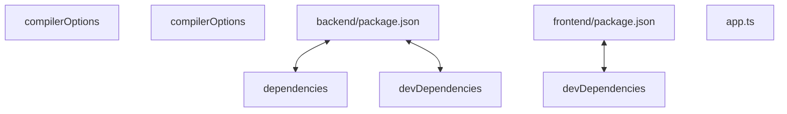

# Codebase Architectural Report

> **Auto-generated** by graphify knowledge graph analysis  
> **Purpose**: Dependency map, connection analysis, subsystem breakdown, and quality hotspots.

---

## 1. Executive Summary

- **Total Components**: `175`
- **Total Connections**: `171`
- **Subsystem Modules**: `1`
- **Dependency Types**: `8`

**Key Architectural Hubs:**

| # | Component | File | Type | Connections |
|---|-----------|------|------|-------------|
| 1 | `compilerOptions` | `frontend/tsconfig.json` | function | 17 |
| 2 | `devDependencies` | `frontend/package.json` | function | 14 |
| 3 | `compilerOptions` | `backend/tsconfig.json` | function | 13 |
| 4 | `devDependencies` | `backend/package.json` | function | 11 |
| 5 | `backend/package.json` | `backend/package.json` | function | 8 |
| 6 | `dependencies` | `backend/package.json` | function | 7 |
| 7 | `frontend/package.json` | `frontend/package.json` | function | 7 |
| 8 | `app.ts` | `backend/src/app.ts` | file | 6 |

---

## 2. Dependency & Connection Analysis

### Relationship Types

| Relationship | Count | Share |
|-------------|-------|-------|
| `contains` | 108 | 63% |
| `imports` | 37 | 22% |
| `extends` | 13 | 8% |
| `imports_from` | 5 | 3% |
| `references` | 4 | 2% |
| `calls` | 2 | 1% |
| `indirect_call` | 1 | 1% |
| `rationale_for` | 1 | 1% |

### Hub Dependency Diagram

### Most Connected Pairs

| Component A | Component B | Shared Connections |
|-------------|-------------|-------------------|
| `build` | `scripts` | 2 |
| `dev` | `scripts` | 2 |
| `scripts` | `start` | 2 |
| `scripts` | `test` | 2 |
| `@types/node` | `devDependencies` | 2 |
| `devDependencies` | `typescript` | 2 |
| `devDependencies` | `vitest` | 2 |
| `@types/node` | `@types/node` | 2 |
| `typescript` | `typescript` | 2 |
| `vitest` | `vitest` | 2 |

---

## 3. Subsystem & Module Breakdown

### 3.1 frontend/package.json
**Nodes**: `175`  
**Files**: `.engine/memory/progress_summary.md`, `backend/package.json`, `backend/src/app.ts`, `backend/src/config.ts`, `backend/src/index.ts`, `backend/src/middleware/errorHandler.ts` +14 more

| Component | Type | File | Connections |
|-----------|------|------|-------------|
| `compilerOptions` | function | `frontend/tsconfig.json` | 17 |
| `devDependencies` | function | `frontend/package.json` | 14 |
| `compilerOptions` | function | `backend/tsconfig.json` | 13 |
| `devDependencies` | function | `backend/package.json` | 11 |
| `backend/package.json` | function | `backend/package.json` | 8 |
| `dependencies` | function | `backend/package.json` | 7 |
| `frontend/package.json` | function | `frontend/package.json` | 7 |
| `app.ts` | file | `backend/src/app.ts` | 6 |
| `config.ts` | file | `backend/src/config.ts` | 6 |
| `Button.tsx` | class | `frontend/components/Button.tsx` | 6 |

**External dependencies:** `NOTE: This file should not be edited` (1)

---

## 4. API Reference

Public classes and functions by subsystem.

### frontend/package.json

| Name | Type | File | Connections |
|------|------|------|-------------|
| `compilerOptions` | function | `frontend/tsconfig.json` | 17 |
| `devDependencies` | function | `frontend/package.json` | 14 |
| `compilerOptions` | function | `backend/tsconfig.json` | 13 |
| `devDependencies` | function | `backend/package.json` | 11 |
| `backend/package.json` | function | `backend/package.json` | 8 |
| `dependencies` | function | `backend/package.json` | 7 |
| `frontend/package.json` | function | `frontend/package.json` | 7 |
| `Button.tsx` | class | `frontend/components/Button.tsx` | 6 |

---

## 5. Code Quality & Architectural Risk Hotspots

### Component Type Distribution

| Type | Count | Share |
|------|-------|-------|
| function | 139 | 79% |
| class | 16 | 9% |
| file | 11 | 6% |
| method | 9 | 5% |

### High-Connectivity Hotspots

**1** component(s) with >15 connections:

| Component | File | Connections |
|-----------|------|-------------|
| `compilerOptions` | `frontend/tsconfig.json` | 17 |

### Dependency Cycles

**11** circular dependency loop(s) detected:

| # | Cycle Path |
|---|-----------|
| 1 | `docker_compose_backend_service → docker_compose_frontend_service → docker_compose_bookmyshow_network` |
| 2 | `frontend_package_devdependencies_types_node → backend_package_json_types_node → backend_package_devdependencies_types_node → backend_package_devdependencies → backend_package_devdependencies_typescript → backend_package_json_typescript → frontend_package_devdependencies_typescript → frontend_package_devdependencies` |
| 3 | `frontend_app_layout → frontend_components_header → frontend_components_header_header` |
| 4 | `backend_src_app → backend_src_middleware_errorhandler → backend_src_middleware_errorhandler_errorhandler` |
| 5 | `backend_src_app → backend_src_app_createapp → backend_src_middleware_errorhandler_errorhandler` |
| 6 | `backend_src_index → backend_src_index_main → backend_src_app_createapp` |
| 7 | `backend_src_app → backend_src_index → backend_src_app_createapp` |
| 8 | `backend_src_app → backend_src_config_config → backend_src_index` |
| 9 | `backend_src_config → backend_src_config_config → backend_src_index` |
| 10 | `backend_src_app → backend_src_config → backend_src_index` |

### Orphaned Components

**5** isolated node(s) with no connections:

| Component | File |
|-----------|------|
| `postcss.config.js` | `frontend/postcss.config.js` |
| `Todo: auth — status pending` | `todos.yaml` |
| `Todo: catalog — status pending` | `todos.yaml` |
| `Todo: booking — status pending` | `todos.yaml` |
| `Ticket favicon (SVG, brand red #e2382f stroke)` | `frontend/public/favicon.svg` |

---

## 6. How to Navigate

1. **Interactive D3 Map** — open `graph.html` to explore node connections visually.
2. **Knowledge Graph Queries** — use MCP tools (`graph_query`, `graph_explain_node`, `graph_impact_radius`).
